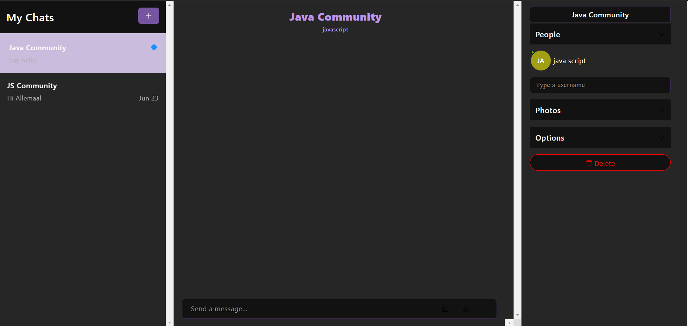

# Welcome to MS Teams Clone!

### [Example Website](https://chat-app-javascript.netlify.app/)

## Introduction

This is a chat app built with React JS and [Chat Engine](https://chatengine.io)!

React JS is the programming language of choice, and Chat Engine is a set of APIs and UI Kit specific to chat.

Its a good example of learning react and creating something production ready!
